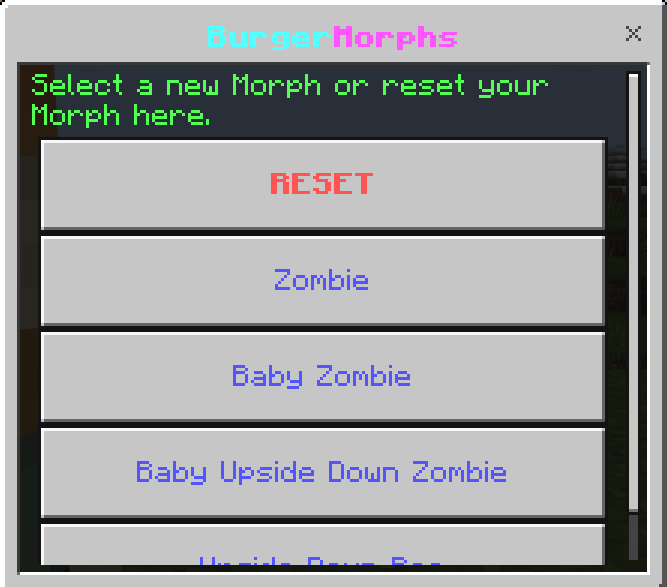

# BurgerMorphs
This plugin adds a Morphs system to PMMP. Players can morph into most mobs available in
the game. Players can also morph into baby versions and upside down versions of the mobs.
The morph is only visible to other players and doesn't display to the player itself.
Possible usecases include: Selling Morphs as cosmetics, Roleplay servers, Hide and Seek servers 
and anything else a server owner might want to use it for.
# Features
- Players can morph into any mob
- Players can also baby mobs, upside down mobs and rainbow sheep
- Several permission nodes which grant a player access to specific morphs
- UI to display available morphs as well as reset the morph and turn into a player
- Several PvP settings to configure how morphs are handled during PvP
- Setting to toggle nametag display on mobs
- Configurable messages
# Commands
- /adminmorph: Morph a player into a mob or reset him back to a player
- /morph: Opens a UI that allows a player to select as well as disable their morph
# Morph Permissions
Admins can give players the permission `burgermorphs.<morph>` to give a player access
to a specific morph.
For example:  
- `burgermorphs.zombie`: Gives a player access to the Zombie morph
- `burgermorphs.baby_bee`: Gives a player access to the Baby Bee morph
- `burgermorphs.dinnerbone_irongolem`: Gives a player access to the Upside Down Iron Golem morph
- `burgermorphs.rainbowsheep`: Gives a player access to the Rainbow Sheep Morph
- `burgermorphs.baby_dinnerbone_ravager`: Gives a player access to the Baby Upside Down Ravager Morph  

Additional morphs can be found by using /morph list
# Admin Permissions
- `burgermorphs.adminmorph`: Allows a player access to /adminmorph
- `burgermorphs.morph`: Allows a player access to /morph
- `burgermorphs.all`: Allows a player access to all morphs
# Showcase

# Note
- This plugin uses https://github.com/jojoe77777/FormAPI to render forms
- The Rainbow Sheep morph's upside down version does not work